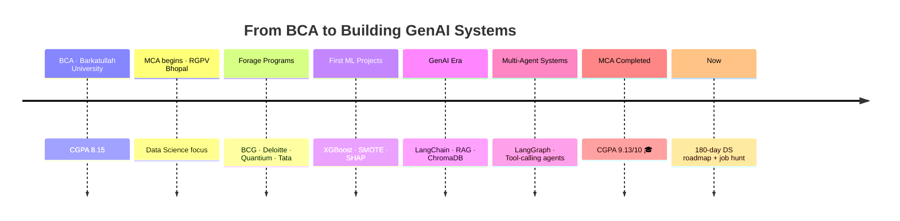

<h1 align="center">Hi, I'm Abhishek Gorya 👋</h1>
<h3 align="center">Data Scientist in the making · GenAI / ML Engineer · Building AI systems end-to-end</h3>

<p align="center">
  <a href="https://www.linkedin.com/in/abhishekgorya/"></a>
  <a href="mailto:abhishekgorya8@gmail.com"></a>
  <a href="https://leetcode.com/u/avi0628/"></a>
  <a href="https://avi-aivideotranscripterassistant.streamlit.app"></a>
</p>

<p align="center">
  
</p>

<p align="center">
  
</p>

<p align="center">
  
</p>

---

### 👨‍💻 About Me

```yaml
name: Abhishek Gorya
role: MCA Graduate (2026) @ UIT, RGPV Bhopal
final_cgpa: 9.13 / 10  🎓
focus: Data Science · GenAI Engineering · ML Systems
looking_for: Data Scientist / Data Analyst / ML-AI Engineer roles
locations: [Bengaluru, Gurugram, Remote]
current_grind: 180-day Data Science roadmap (Python → Stats → ML → Deployment)
philosophy: "Ship it, deploy it, break it, fix it — then explain why it broke."
```

- 🎓 **MCA — 9.13/10 CGPA** · University Institute of Technology, RGPV Bhopal · **BCA** — Barkatullah University (CGPA 8.15)
- 🧪 Completed a **Python/Data Analysis traineeship** + 7 industry-simulated **Forage programs** (BCG, Deloitte, Quantium, Tata)
- 🤖 Design and ship **full GenAI pipelines** — not just prompting, but agents, RAG, tool-calling, and evaluation
- 📈 Every ML project follows the same discipline: **baseline → diagnose the failure → fix it → prove it with metrics**
- 🌱 Currently deep in **agentic AI systems, LangGraph patterns, and statistical foundations**
- 📫 **abhishekgorya8@gmail.com**

---

### 🧗 My Journey



It started with SQL queries and Pandas dataframes — clean, satisfying, deterministic. Then came the messier, more interesting problem: models that were "accurate" on paper but useless in practice (hello, 84% accuracy with **zero recall**). Fixing that taught me more about being a data scientist than any tutorial did.

Somewhere along the way, GenAI pulled me in — not as a novelty, but as an engineering problem. Prompting alone wasn't enough; I wanted systems that could **retrieve, reason, critique, and act**. That's what led to building multi-agent research pipelines and RAG-backed assistants instead of just chatting with an LLM.

Today, I graduate with a **9.13/10 CGPA**, a portfolio of shipped, deployed apps, and a clear next chapter: go deeper into statistics, deep learning, and agentic architectures — while looking for a team to build all of this with in production.

---

### 🚀 Featured Projects

<table>
<tr>
<td width="50%" valign="top">

#### 🎥 [AI Video Transcripter Assistant](https://github.com/AbhishekGorya/AIVideoTranscripterAssistant)
Caption-first YouTube → structured report pipeline.

- **Ingestion:** `youtube-transcript-api` (primary) → Whisper + `yt-dlp` (audio fallback) → Sarvam AI (Hinglish)
- **Reasoning:** LangChain map-reduce summarization on Mistral, structured extraction of action items & decisions
- **Retrieval:** ChromaDB-backed RAG chatbot to query the transcript conversationally
- **Interfaces:** Streamlit UI + standalone CLI

🔗 [Live App](https://avi-aivideotranscripterassistant.streamlit.app) &nbsp;·&nbsp; `LangChain` `Whisper` `ChromaDB` `Streamlit`

</td>
<td width="50%" valign="top">

#### 🔎 [GenAI Multi-Agent Research System](https://github.com/AbhishekGorya/GenAI-MultiAgentResearchSystem)
Autonomous 4-agent pipeline that researches a topic end-to-end.

- **Search Agent** → Tavily Search API pulls relevant sources
- **Reader Agent** → BeautifulSoup extracts & cleans web content
- **Writer Agent** → Mistral Small synthesizes a structured report
- **Critic Agent** → reviews and refines the output before delivery
- Live per-step status in the UI + downloadable Markdown report

🔗 [Live App](https://avi-genai-multiagentresearchsystem.streamlit.app) &nbsp;·&nbsp; `LangChain` `Multi-Agent` `Tavily API`

</td>
</tr>
<tr>
<td width="50%" valign="top">

#### 🧩 [AgenticAI — Learning & Implementation](https://github.com/AbhishekGorya/AgenticAI-LearningAndImplementation)
Hands-on lab for core agentic workflow patterns using LangGraph.

- **Sequential, Conditional & Parallel** graph workflows
- **Iterative** loop-based agents with retry/refine logic
- **Human-in-the-loop** checkpointing for approval-gated execution
- A Smart College Chatbot built to apply conditional routing in practice

`LangGraph` `LangChain` `FAISS` `Groq`

</td>
<td width="50%" valign="top">

#### 💳 [Customer Credit Delinquency Prediction](https://github.com/AbhishekGorya/Complete-ML-Models-ClassificationsBased)
The classic imbalanced-classification trap, solved properly.

- Baseline model hit 84% accuracy — but **zero recall** on the minority (defaulter) class
- Diagnosed the imbalance, applied **SMOTE** resampling + **threshold tuning**
- Rebuilt as a 4-step structured pipeline with a Streamlit GUI for live predictions

`XGBoost` `SMOTE` `Scikit-learn` `Streamlit`

</td>
</tr>
<tr>
<td width="50%" valign="top">

#### 🩺 [GenAI Disease Risk Prediction](https://github.com/AbhishekGorya/GenAiPoweredEarlyDiseasePredictionModel)
Risk-scoring app with model explainability built in.

- XGBoost classifier for early disease risk scoring
- **SHAP** values expose *why* the model made each prediction, not just the score
- Deployed as an interactive Streamlit app

`XGBoost` `SHAP` `Streamlit`

</td>
<td width="50%" valign="top">

#### 🛒 [E-Commerce Data Analytics Pipeline](https://github.com/AbhishekGorya/DataAnalytics-Projects)
Python + MySQL pipeline over **50,000+ records**.

- 15+ analytical SQL queries surfacing revenue, retention & product-level insights
- Clean ETL flow from raw transactional data to query-ready tables

`Python` `MySQL` `Pandas`

</td>
</tr>
<tr>
<td width="50%" valign="top">

#### 🚕 [Urban Ride Analytics Dashboard](https://github.com/AbhishekGorya/DataAnalytics-Projects)
Power BI dashboard over **100,000+ ride records**.

- DAX measures for demand patterns, peak-hour analysis, and revenue trends
- Interactive drill-downs for city/route-level performance

`Power BI` `DAX`

</td>
<td width="50%" valign="top">

#### 📁 More on the way
This grid keeps growing as I ship new agentic and ML systems.

- Next up: RAG agent over FAISS + HuggingFace embeddings
- Next up: Multi-agent handoff systems
- Next up: A deployed deep-learning project (PyTorch/TensorFlow)

</td>
</tr>
</table>

<p align="center"><i>More projects → <a href="https://github.com/AbhishekGorya?tab=repositories">explore all repositories</a></i></p>

---

### 🛠️ Tech Stack

<details open>
<summary><b>🧠 GenAI / LLM Engineering</b></summary>
<br>

| Category | Tools |
|---|---|
| **Orchestration** | LangChain · LangGraph · Chains · Runnables |
| **Agentic Systems** | Multi-Agent pipelines · Sequential/Conditional/Parallel/Iterative workflows · Human-in-the-loop · Tool-calling · ReAct-style agents |
| **Retrieval (RAG)** | ChromaDB · FAISS · Vector embeddings · Semantic search |
| **LLM Providers** | Groq · Mistral (Small/API) · Sarvam AI (Hinglish) |
| **Search / Tools** | Tavily Search API · BeautifulSoup (web extraction) |
| **Audio → Text** | Whisper · yt-dlp · YouTube Transcript API |
| **Evaluation mindset** | Structured output extraction · Map-reduce summarization · Critic/review loops |

</details>

<details open>
<summary><b>📊 Data Science & Machine Learning</b></summary>
<br>

| Category | Tools |
|---|---|
| **Modeling** | Scikit-learn · XGBoost · Logistic Regression · SVM · KNN |
| **Imbalance Handling** | SMOTE · Threshold tuning · Class-weighting |
| **Explainability** | SHAP |
| **NLP (classical)** | TF-IDF · Sentiment classification |
| **Data Wrangling** | Pandas · NumPy |
| **Visualization** | Matplotlib · Power BI · DAX |

</details>

<details open>
<summary><b>💻 Core & Tools</b></summary>
<br>

| Category | Tools |
|---|---|
| **Languages** | Python · SQL (MySQL) |
| **App Deployment** | Streamlit Community Cloud |
| **Dev Tools** | Git · GitHub · Jupyter Notebook · VS Code |
| **Currently building toward** | TensorFlow · PyTorch · Hugging Face (deep learning fundamentals) |

</details>

---

### 📊 GitHub Stats & Streaks

<p align="center">
  
  
</p>

<p align="center">
  
</p>

<p align="center">
  
</p>

---

### 📈 LeetCode Progress & Streak

<p align="center">
  
</p>

<p align="center">112+ problems solved &nbsp;·&nbsp; 🏆 <b>Top SQL 50</b> badge &nbsp;·&nbsp; Focus: Window Functions · CTEs · Query Optimization</p>

---

### 🎯 Future Targets

- [ ] Land a **Data Scientist / Data Analyst / ML-AI Engineer** role in Bengaluru, Gurugram, or Remote
- [ ] Finish the **180-day Data Science roadmap** — Python → Stats → ML → Deployment
- [ ] Go deeper into **LangGraph** for stateful, multi-agent orchestration at production scale
- [ ] Ship a **RAG agent** over FAISS + HuggingFace embeddings end-to-end
- [ ] Get hands-on with **deep learning** — PyTorch / TensorFlow — beyond classical ML
- [ ] Build a **multi-agent handoff system** where agents delegate sub-tasks to each other

### 🌠 The Bigger Dream

To become the kind of engineer who doesn't just fine-tune models but **architects reliable, production-grade AI systems** — the person a team trusts to take an idea from "can an LLM do this?" to a deployed, monitored, and explainable system in the real world. Long-term, that means building (or joining early on) products at the intersection of **agentic AI and decision intelligence** — systems that don't just answer questions, but *act* on them responsibly.

---

<p align="center">
  
</p>

<p align="center"><i>💬 Open to Data Scientist, Data Analyst, and GenAI Engineer roles — let's talk!</i></p>
