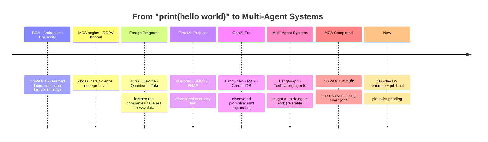

# Hi, I'm Abhishek Gorya 👋
**Data Scientist in the making · GenAI / ML Engineer · Professional bug-whisperer**

🎓 **9.13/10 CGPA** — MCA @ RGPV Bhopal
🧠 GenAI & Agentic AI Engineer in training
📍 Bengaluru · Gurugram · Remote
📫 abhishekgorya8@gmail.com
 

  
  
  
  

  

  

  
  
  
  

  

---

### 👋 About Me — the human-readable version

Somewhere between a stats textbook and a LangGraph diagram, I found the thing I actually want to do: build AI systems that don't just *sound* smart, but actually work when nobody's watching.

> 🎓 Just wrapped up my **MCA at RGPV Bhopal with a 9.13/10 CGPA** — the kind of number that makes relatives ask "so what job now?" at every family function.
>
> 🧠 I spend my days making LLMs retrieve, reason, argue with themselves (Critic Agent, I'm looking at you), and occasionally behave.
>
> 📊 On the data science side, I have a personal vendetta against models that report 84% accuracy while quietly ignoring the one class that actually mattered.
>
> 📍 Hunting for a **Data Scientist / Data Analyst / ML-AI Engineer** role — Bengaluru, Gurugram, or anywhere with decent WiFi (Remote).
>
> 📫 Reach me at **abhishekgorya8@gmail.com** — I reply faster than most of my models converge.

---

### 🎮 Fun Facts About Me

> *(the stats you won't find on a resume, but honestly should)*

☕ **Chai : Code ratio** — roughly 3:1, and I will defend this
🌙 **Peak brain hours** — 11 PM to 2 AM, professionally diagnosed night owl
🐞 **Superpower** — reading a stack trace like it's a text from a friend
🔁 **Most repeated sentence** — "let me just retrain it real quick"
🎯 **Actual hobby** — turning "it doesn't work" into "wait, why did that even work"
🤖 **Trust issues** — with any model that hits 99% accuracy on the first try
📚 **Currently reading** — documentation I should've read *before* writing the code
🚀 **Ultimate goal** — ship something so good even my own Critic Agent can't find a flaw

---

### 🧗 My Journey (a very unofficial timeline)

It started with SQL queries and dataframes — clean, satisfying, predictable. Then came the plot twist: a model that looked "accurate" on paper but had **zero recall** on the class that actually mattered. Fixing that taught me more about being a data scientist than any course did.

Then GenAI happened, and I fell down the agent rabbit hole — not the "chat with a bot" kind, but the "build a Search Agent, a Reader Agent, a Writer Agent, and a Critic Agent that argue until the output is actually good" kind.

Today: **9.13/10 CGPA**, a portfolio of things that are actually deployed (not just "works on my machine"), and a very clear next mission below. 👇

---

### 🚀 Featured Projects

<b>🎥 AI Video Transcripter Assistant</b> — turns a YouTube video into a report before you've finished your chai

 

Caption-first pipeline: `youtube-transcript-api` → Whisper + `yt-dlp` fallback → Sarvam AI for Hinglish, LangChain map-reduce summarization on Mistral, and a ChromaDB-backed RAG chatbot so you can *ask* the video questions instead of rewatching it.

🔗 [Live App](https://avi-aivideotranscripterassistant.streamlit.app) · [Repo](https://github.com/AbhishekGorya/AIVideoTranscripterAssistant)
🏷️ `LangChain` `Whisper` `ChromaDB` `Streamlit`

<b>🔎 GenAI Multi-Agent Research System</b> — 4 AI agents walk into a research task...

 

**Search Agent** finds sources (Tavily) → **Reader Agent** cleans the web mess (BeautifulSoup) → **Writer Agent** drafts a report (Mistral Small) → **Critic Agent** roasts it and sends it back for revision. Live status updates + a downloadable Markdown report at the end.

🔗 [Live App](https://avi-genai-multiagentresearchsystem.streamlit.app) · [Repo](https://github.com/AbhishekGorya/GenAI-MultiAgentResearchSystem)
🏷️ `LangChain` `Multi-Agent` `Tavily API`

<b>🧩 AgenticAI — Learning & Implementation</b> — my agentic-workflow gym

 

Where I go to lift heavier agent graphs: Sequential, Conditional, and Parallel workflows, Iterative loops that retry until they earn it, and Human-in-the-loop checkpoints so a human can veto the AI before it does anything questionable. Includes a Smart College Chatbot built to prove the conditional routing actually works.

🔗 [Repo](https://github.com/AbhishekGorya/AgenticAI-LearningAndImplementation)
🏷️ `LangGraph` `LangChain` `FAISS` `Groq`

<b>💳 Customer Credit Delinquency Prediction</b> — the imbalanced-classification trap, defused

 

Baseline model: 84% accuracy, **zero recall** on defaulters — technically correct, practically useless. Fixed it with SMOTE resampling and threshold tuning, then wrapped the whole thing in a 4-step Streamlit pipeline so it's actually usable, not just "notebook-only."

🔗 [Repo](https://github.com/AbhishekGorya/Complete-ML-Models-ClassificationsBased)
🏷️ `XGBoost` `SMOTE` `Scikit-learn` `Streamlit`

<b>🩺 GenAI Disease Risk Prediction</b> — a model that shows its work

 

XGBoost for the risk score, SHAP for the "okay but *why* did it say that" — because a prediction nobody can explain is a prediction nobody should trust. Deployed as an interactive Streamlit app.

🔗 [Repo](https://github.com/AbhishekGorya/GenAiPoweredEarlyDiseasePredictionModel)
🏷️ `XGBoost` `SHAP` `Streamlit`

<b>🛒 E-Commerce Data Analytics Pipeline</b> — 50,000+ records, 15+ SQL queries, zero excuses

 

A clean Python + MySQL ETL flow surfacing revenue, retention, and product-level insights from raw transactional data.

🔗 [Repo](https://github.com/AbhishekGorya/DataAnalytics-Projects)
🏷️ `Python` `MySQL` `Pandas`

<b>🚕 Urban Ride Analytics Dashboard</b> — 100,000+ rides, one very busy Power BI dashboard

 

DAX measures for demand patterns, peak-hour trends, and revenue — with drill-downs down to the city/route level.

🔗 [Repo](https://github.com/AbhishekGorya/DataAnalytics-Projects)
🏷️ `Power BI` `DAX`

<i>🔭 More lurking → <a href="https://github.com/AbhishekGorya?tab=repositories">explore all repositories</a></i>

---

### 🛠️ Tech Stack — assemble the squad

<b>🧠 The Brains — GenAI / LLM Engineering</b>

 

*Translation: I make LLMs retrieve things, call tools, and occasionally disagree with each other on purpose.*

<b>🏋️ The Muscle — Data Science & ML</b>

 

*Translation: I diagnose why your 99% accuracy model is secretly terrible.*

<b>🧰 The Toolbox — Core & Deployment</b>

 

*Currently leveling up in:*

---

### 🏆 Achievements Unlocked

---

### 📊 GitHub Stats & Streaks

  

<i>Prefer stats that actually move? Scroll all the way down and feed the snake. 🐍</i>

---

### 📈 LeetCode Progress & Streak

  

135 problems solved (92 Easy · 42 Medium · 1 Hard) &nbsp;·&nbsp; 🏆 <b>Top SQL 50</b> badge &nbsp;·&nbsp; secretly enjoys window functions more than most hobbies

---

### 🎯 Future Targets

🎯 Land a **Data Scientist / Data Analyst / ML-AI Engineer** role (Bengaluru · Gurugram · Remote)
📅 Finish the **180-day Data Science roadmap** — Python → Stats → ML → Deployment
🕸️ Go deeper into **LangGraph** for production-grade multi-agent orchestration
📚 Ship a full **RAG agent** over FAISS + HuggingFace embeddings
🧬 Get properly hands-on with **deep learning** — PyTorch / TensorFlow, no more avoiding it
🤝 Build a **multi-agent handoff system** — agents that delegate like a functioning team (unlike some humans)

### 🌠 The Bigger Dream

To be the engineer a team trusts with the scary sentence *"can an LLM do this?"* — and comes back with something deployed, monitored, explainable, and actually reliable. Long-term: building at the intersection of **agentic AI and decision intelligence**, where systems don't just answer questions, they *act* on them responsibly. Short-term: getting hired by someone who reads this far down a README. 👀

---

  

<i>💬 Open to Data Scientist, Data Analyst, and GenAI Engineer roles — let's talk (or at least argue about bias-variance tradeoff)!</i>

🥚 Psst — if you've read this far, you've officially unlocked "Actually Read The Whole README" status. Rare achievement.

---

### 🐍 One Last Thing — Feed My Contribution Snake

*A snake that literally eats my GitHub contribution graph. Unnecessary? Yes. Fun? Also yes.*

<picture>
  <source media="(prefers-color-scheme: dark)" srcset="https://raw.githubusercontent.com/AbhishekGorya/AbhishekGorya/output/github-contribution-grid-snake-dark.svg" />
  <source media="(prefers-color-scheme: light)" srcset="https://raw.githubusercontent.com/AbhishekGorya/AbhishekGorya/output/github-contribution-grid-snake.svg" />
  
</picture>

⚙️ Powered by a GitHub Action that re-generates this once a day — setup file included below.

